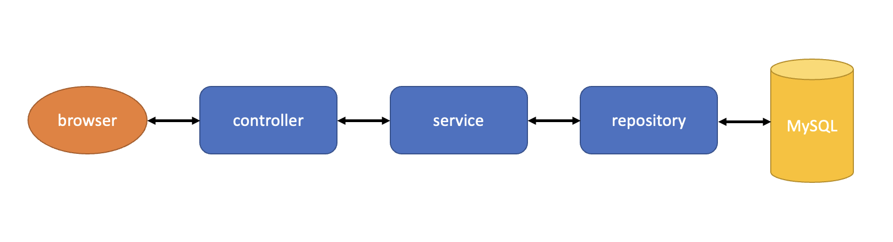

### Student Management System

Yuan Chen

yc5118@nyu.edu


#### Outline

The project is a simple student management system with basic CRUD function based on the Spring Boot framework.

It includes the knowledge of networking, databases, REST API and Sping Framework of Java. The basic architecture of my project is as the following shows. 




#### Basic Functions

- **Login/Register:**

  - **Login:** 

    1. There are two type of users: teachers and students. They can both login the system with account number and password. 
    2. Users can not get access to any page of the system before login.
    3. The password is encrypted by MD5 in the database.

    **Register**: 

    1. Students can register their account through the register page. They can set account name, account number and password. 
    2. System can check whether the same account name and account number has already existed in the database. If the account name and account number has already existed, require the user to enter new account name and account number.
    3. Teachers' account should be manually added to the database.

    

- **Teachers' function:** 

  - **Change password:**

    1. Teachers can change their account password. The password can not be the same with the original. The password is save in MD5 in the database.

  - **Add course:**

    1. Teachers can add new courses: set the course name, the credit of the course, the total student limit, and the begin and end date of the course

  - **Course tabe:**

    Teachers can see their own courses in the course table, they can not see other teachers' courses.

    1. Course detail:

       Teachers can see all the students who have enrolled this course in the detail page.

       Teachers can save each students' grade in the detail page.

    2. Archive:

       Archive means archive all the students' grade and end this course. After archiving the course, all the students' grade can not be changed.

    

- **Students:**

  - **Course statistics:**

    In the dashboard page, students can see the course statistics. 

    1. The students can see the credits they earned , the total courses they've taken, and the average grade (previous three statistics are all based on the course which have been already archived by the teachers).

  - **Change password:**

    1. Students can change their account password. The password can not be the same with the original. The password is save in MD5 in the database.

  - **Enroll a course:**

    1. In the course table, students can see the list of all the courses which have not been archived.
    2. Students can enroll the course before the end date of the courses.
    3. Students can enroll the course which has remaining seats.

  - **Drop a course**:

    1. Student can see the grade of a couse he/she have enrolled in this page.
    2. Students can drop this course before the teacher archive this course.
    3. As long as the teacher archive the course, student can no longer drop this course.
  
    
    

#### Technologies

- **Back-end:**

  - Java 1.8
  - MySQL
  - Spring Boot
  - Spring Date JPA
  - Lombok
  - Thymeleaf

    

- **Front-end:** 

  - Vue.js
  - JQuery
  - Ajax
  - BootStrap
  - [Light Bootstrap Dashboard](https://github.com/creativetimofficial/light-bootstrap-dashboard)

  

#### Database Design

- **User table**

  |                 | Type         | Description                       |
  | :-------------- | :----------- | :-------------------------------- |
  | **id**          | int          | key, auto increment               |
  | **created**     | datetime     |                                   |
  | **is\_deleted** | boolean      | default false                     |
  | **updated**     | datetime     |                                   |
  | **credit**      | int          | default 0                         |
  | **number**      | int          |                                   |
  | **password**    | varchar(255) |                                   |
  | **role**        | int          | default 0, 0: student, 1: teacher |
  | **name**        | varchar(255) |                                   |

- **Course table**

  |                 | Type         | Description         |
  | :-------------- | :----------- | :------------------ |
  | **id**          | int          | key, auto increment |
  | **created**     | datetime     |                     |
  | **is\_deleted** | boolean      | default false       |
  | **updated**     | datetime     |                     |
  | **credit**      | int          | default 0           |
  | **end\_time**   | datetime     |                     |
  | **name**        | varchar(255) |                     |
  | **begin\_time** | datetime     |                     |
  | **stu\_limit**  | int          | default 0           |
  | **stu\_num**    | int          | default 0           |
  | **teacher\_id** | int          | foreign key         |

- Course User table

  |                 | **Type** | Description         |
  | :-------------- | :------- | :------------------ |
  | **id**          | int      | key, auto increment |
  | **created**     | datetime |                     |
  | **is\_deleted** | boolean  | default false       |
  | **updated**     | datetime |                     |
  | **grade**       | double   | default 0           |
  | **course\_id**  | int      | foreign key         |
  | **stu\_id**     | int      | foreign key         |


#### Use the project

1. Download/Clone the project

2. Create a schema called "elective" in the database

3. Make sure the yml configuration is correct. 

   The url should be consistent with the name of schema you created in the database.

   The username and password of the datasource should be correct. 

   the yml configuration file is located at the path: src/main/resources/application.yml

   ```yaml
   server:
     port: 8080
   
   spring:
     # config of data source
     datasource:
       driver-class-name: com.mysql.cj.jdbc.Driver
       url: jdbc:mysql://localhost:3306/elective?useUnicode=true&characterEncoding=utf-8
       username: root
       password: cycy1005
   
     jpa:
       hibernate:
         # create or update
         ddl-auto: update
       # whether to show the sql in terminal
       show-sql: true
   
   thymeleaf:
     cache: false
     prefix:
       classpath: /templates
   ```

4. Run the project in the IDE

   I use IntelliJ IDEA. JPA will automatically create the tables.

5. Run the test file to insert the test user into the database

   the test file is located at the path: src/test/java/com/example/demo/service/impl/UserServiceImplTest.java

6. Open the browser http://localhost:8080/


